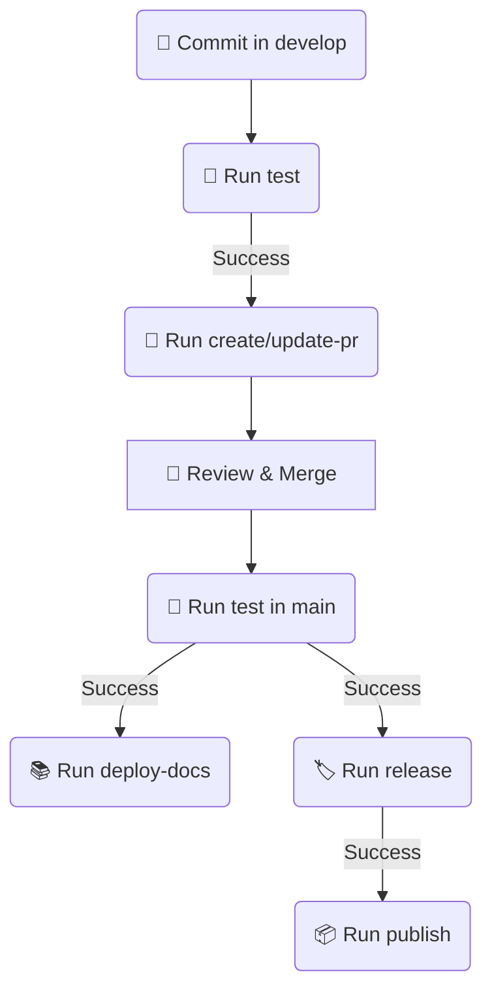

# gh-test-automations

Testando ci-reusable

- [x] testar via ci-reusable
- [x] criar pull request via ci-reusable
- [ ] criar badge coverage
- [ ] checar novamente a criação de pull request com a action de ci-reusable
- [ ] release ainda não funciona....
- [ ] implementar publish
- [ ] implementar deploy-docs

