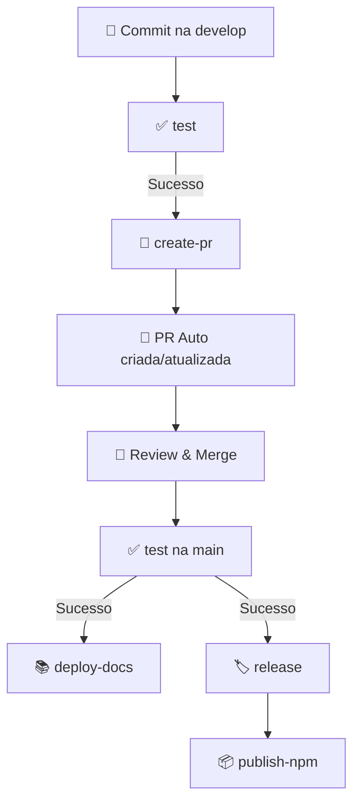

# gh-test-automations

```mermaid
graph TD
    A[🚀 Commit na develop] --> B[✅ test]
    B -->|Sucesso| C[📝 create-pr]
    C --> D[🔄 PR Auto criada/atualizada]
    D --> E[👥 Review & Merge]
    E --> F[✅ test na main]
    F -->|Sucesso| G[📚 deploy-docs]
    F -->|Sucesso| H[🏷️ release]
    H --> I[📦 publish-npm]

```

