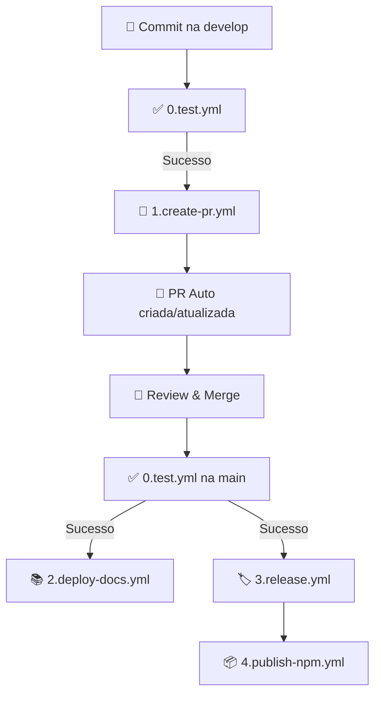

# gh-test-automations

```mermaid
graph TD
    A[🚀 Commit na develop] --> B[✅ 0.test.yml]
    B -->|Sucesso| C[📝 1.create-pr.yml]
    C --> D[🔄 PR Auto criada/atualizada]
    D --> E[👥 Review & Merge]
    E --> F[✅ 0.test.yml na main]
    F -->|Sucesso| G[📚 2.deploy-docs.yml]
    F -->|Sucesso| H[🏷️ 3.release.yml]
    H --> I[📦 4.publish-npm.yml]

```

