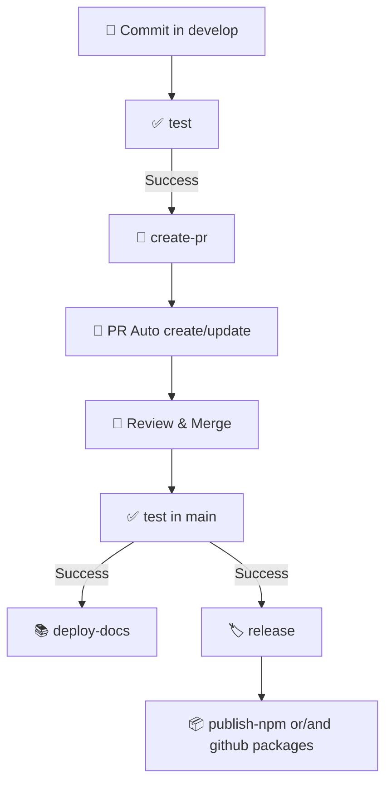

# gh-test-automations

testando ci-reusable

```mermaid
graph TD
    A[🚀 Commit in develop] --> B[✅ test]
    B -->|Success| C[📝 create-pr]
    C --> D[🔄 PR Auto create/update]
    D --> E[👥 Review & Merge]
    E --> F[✅ test in main]
    F -->|Success| G[📚 deploy-docs]
    F -->|Success| H[🏷️ release]
    H --> I[📦 publish-npm or/and github packages]

```
