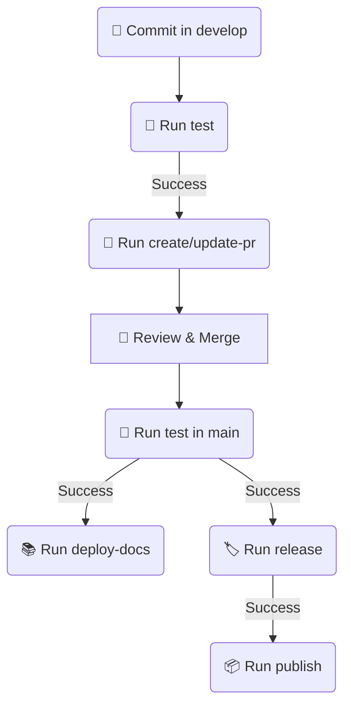

# gh-test-automations

Testando ci-reusable

```mermaid
graph TD
    A(🚀 Commit in develop) --> B(🧪 Run test)
    B --> |Success| C(🔄 Run create/update-pr)
    C --> D[👥 Review & Merge]
    D --> E(🧪 Run test in main)
    E --> |Success| F(📚 Run deploy-docs)
    E --> |Success| G(🏷️ Run release)
    G --> |Success| H(📦 Run publish)

```

